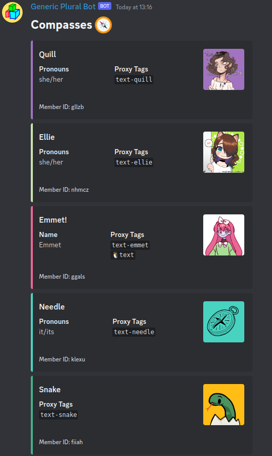

# Headmate Labeller
Firstly, sorry for the confusing project name.

This is a simple discord bot which allows you to create a list of headmates in a specific channel.

This project may end up being integrated into my [general purpose plural bot](https://gitlab.com/Compass_System/compass-plural-bot).

Sample Output (for our pluralkit system):



## Setup
1. Download the latest release [here](https://github.com/CompassSystem/headmate-labeller/releases/tag/latest) and extract it into its own folder.
2. Create a file in the same directory called `.env` and fill out the following:
```
DISCORD_TOKEN=token_for_your_discord_bot
PLURALKIT_TOKEN=token_for_your_pluralkit_system

# Optional - if you want to only sync commands with your guild
TEST_GUILD=your_discord_guild_id
```
3. Run the bot by running `java -jar headmate-labeller-x.y.z.jar` where x.y.z is the release version.

## Usage
The following commands are available:
```
/headmate-labeller list [ignore] - Create or update a list of headmates. Optionally ignoring a comma seperated list of headmate names or ids.
/headmate-labeller purge [ignore] - Delete headmate embeds that are missing from the PluralKit system.  Optionally ignoring a comma seperated list of headmate names or ids.
/headmate-labeller refresh - Refresh the PluralKit system cache.
```
